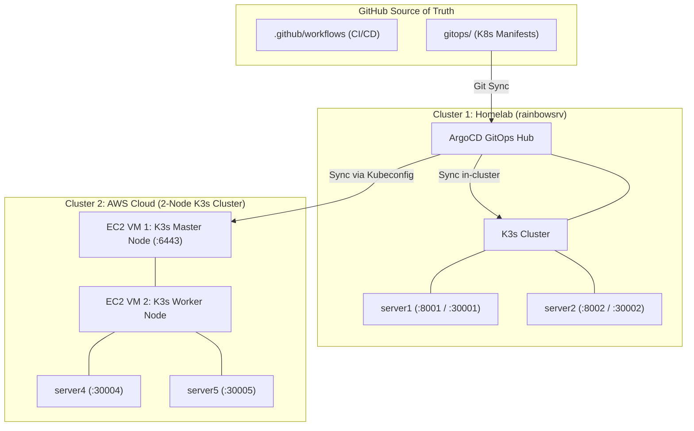

# DevOps Multi-Cluster GitOps Platform Demo

A hybrid homelab & AWS multi-cluster GitOps platform demonstrating:

- **GitOps Continuous Delivery:** ArgoCD (installed on Ubuntu `rainbowsrv`)
- **Infrastructure as Code:** Terraform (Docker provider + AWS EC2 2-Node K3s Cluster)
- **CI/CD Automation:** GitHub Actions (Build Matrix & Self-Hosted Runner)
- **Multi-Cluster Orchestration:**
  - **Cluster 1 (Homelab / rainbowsrv):** `server1` & `server2`
  - **Cluster 2 (AWS Cloud 2-VM K3s Cluster):** `server4` & `server5`
- **Application Services:** Python 3.12 FastAPI microservices (`server1` – `server5`)
- **Custom Tooling:** TypeScript GitHub Action for deployment summary & health verification

---

## Architecture Diagram



---

## Service Inventory

| Service | Location | Hosting Type | Port / Endpoint |
|---|---|---|---|
| **Server 1** | Homelab (`rainbowsrv`) | Docker / K3s Pod | `http://localhost:8001/hello` |
| **Server 2** | Homelab (`rainbowsrv`) | Docker / K3s Pod | `http://localhost:8002/hello` |
| **Server 3** | AWS Standalone EC2 | Docker VM | `http://<ec2-ip>:8000/hello` |
| **Server 4** | AWS 2-Node K3s Cluster | Kubernetes Pod (NodePort) | `http://<k3s-master-ip>:30004/hello` |
| **Server 5** | AWS 2-Node K3s Cluster | Kubernetes Pod (NodePort) | `http://<k3s-master-ip>:30005/hello` |

---

## Getting Started

### 1. Install K3s + ArgoCD on `rainbowsrv` (Homelab)

Run the automated setup script on your Ubuntu server:

```bash
chmod +x scripts/setup-argocd-local.sh
./scripts/setup-argocd-local.sh
```

To access the ArgoCD Web UI:
```bash
kubectl port-forward svc/argocd-server -n argocd 8080:443
```
* **URL:** `https://localhost:8080`
* **Username:** `admin`
* **Password:** Output by the setup script (from secret `argocd-initial-admin-secret`)

---

### 2. Provision the AWS 2-VM K3s Cluster via Terraform

When GitHub Actions runs or when running locally:

```bash
cd terraform
terraform init
terraform apply -auto-approve
```

Terraform will output:
* `k3s_master_public_ip`
* `k3s_worker_public_ip`
* `k3s_api_server`

---

### 3. Register AWS Cluster into ArgoCD

Run the registration script with your AWS Master IP:

```bash
./scripts/register-aws-cluster-to-argocd.sh <AWS_MASTER_PUBLIC_IP>
```

ArgoCD will automatically create:
1. `homelab-local-apps` (synchronizing `gitops/clusters/local-cluster`)
2. `aws-k3s-apps` (synchronizing `gitops/clusters/aws-cluster`)

---

## GitHub Secrets Required

| Secret | Description |
|---|---|
| `GHCR_READ_TOKEN` | GitHub PAT to pull container images from GHCR |
| `AWS_ACCESS_KEY_ID` | IAM User Access Key for Terraform AWS provider |
| `AWS_SECRET_ACCESS_KEY` | IAM User Secret Key for Terraform AWS provider |
| `AWS_REGION` | *(Optional, default: `us-east-1`)* Target AWS Region |
